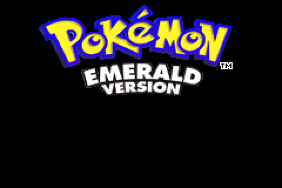

# Gen 3 Remake

**A ROM-accurate Gen 3 engine written in Lua / LÖVE2D that decodes every asset live from the cartridge — nothing is redrawn, re-typed, or baked in.**



`Status: public demo (v0.1.16-alpha) — playable Littleroot → Rustboro. Not affiliated with Nintendo.`

> **No ROM is included or linked.** You supply your own legally obtained
> Pokémon Emerald (USA/Europe) ROM, game code `BPEE`. The app asks for it on first launch.
> See [DISCLAIMER.md](DISCLAIMER.md).

---

## Quickstart

| Platform | Steps |
|---|---|
| **Android** | Install the release APK → launch → pick your `.gba` when asked. |
| **Windows / macOS / Linux** | Install [LÖVE 11.5](https://love2d.org) → open `gen_3_remake_demo_v0.1.16-alpha.love` → pick your `.gba`. |

Saves and the `mods/` folder live in LÖVE's save directory — the exact path is shown in the in-game file picker.

### Controls
| Action | Touch | Keyboard | Pad |
|---|---|---|---|
| Move | D-pad | Arrows / WASD | Left stick / D-pad |
| A / B | A / B buttons | Z / X | A / B |
| Start / Select | Start / Select | Enter / RShift | Start / Back |
| Run | Hold B | Hold X | Hold B |

---

## What works / what doesn't

| Works | Not implemented |
|---|---|
| Overworld: Littleroot → Oldale → Routes 101–104 → Petalburg → Petalburg Woods → Rustboro (first badge) → Route 116 / Rusturf Tunnel | Anything past Rustboro — the demo refuses the map edge with *"The DEMO ends here."* |
| Full battle engine: singles + doubles, abilities, held items, trainer AI, ROM battle animations | Contests, Secret Bases, Battle Frontier, post-game |
| Wild encounters, fishing, running shoes, item balls, hidden items | Link trading / battling, Mystery Gift |
| Pokémon Center, Mart, PC boxes, Pokédex, Trainer Card | Day Care & breeding exist in the engine but sit past the demo border |
| Real-time clock, berry growing | Ruby / Sapphire / FireRed ROMs (Emerald only) |
| Touch (portrait + landscape), gamepad, keyboard | 32-bit ARM devices — release bytecode is arm64 only |
| ROM window frames, fonts, text speed, battle style options | |

---

## How it works

The interesting part isn't the game — it's that there are no assets in the repo.

- **Live decode, every boot.** Maps, tilesets, tile animations, OW and battle sprites, palettes, fonts, dialogue strings, and the species / move / item / trainer / encounter tables are all read out of the ROM at runtime. The shipped `.love` contains engine code and nothing else.
- **Byte-verified against the ROM.** Behaviour is reproduced from the [pret/pokeemerald](https://github.com/pret/pokeemerald) decompilation and checked against real ROM bytes before it ships. Every flag, var, offset and line of dialogue is verified; deliberate deviations are documented.
- **Same addressing as pret.** Maps are `group` / `map`, NPCs are `local_id`, flags/vars/species/items are pret's numeric ids — so anything you know from the disassembly transfers directly.
- **LuaJIT throughout.** Decoders run on raw byte buffers; the release build ships stripped LuaJIT bytecode.

## Modding

Drop a Lua file in `mods/` — no ROM patching, no rebuild, no engine source needed. You can add NPCs, rewrite dialogue, script scenes and battles, override encounter tables, move or reskin objects.

```lua
-- mods/potion_lady.lua
local Q = api.quest
Q.registerInteract(0, 9, 3, {                 -- LITTLEROOT TOWN, localId 3
    { op = "facePlayer", who = 3 },
    { op = "msg", text = "You look like you're heading out.\nTake this!" },
    { op = "giveItem", item = 13, count = 3 },
})
return { name = "Potion Lady", version = "1.0" }
```

Full API in the **[Wiki](../../wiki)**.

## Reporting bugs

[Issues](../../issues) are open. Useful reports include: platform, app version, the map's `Group / Map / Pos` from the debug HUD, and what you did right before it broke.

**Do not attach, link, or ask for ROMs, save files containing ROM data, or ROM sources in issues.** Those get locked and deleted on sight — it's what keeps this project online.

Engine source is not public, so there's nothing to PR. Mods are the contribution surface.

## Legal

Non-commercial fan project. Ships no Nintendo assets and is not affiliated with Nintendo, Creatures Inc. or GAME FREAK. Engine code © the author, all rights reserved — see [LICENSE](LICENSE). Mods you write are yours. Full statement in [DISCLAIMER.md](DISCLAIMER.md).

