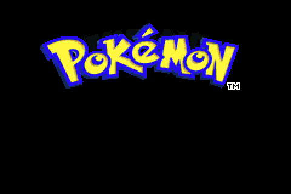

# Gen 3 Remake

**Pokémon Emerald, rebuilt as a modern Lua game — powered by your own cartridge.**

[**Download the latest release**](../../releases/latest) · [Wiki](../../wiki) · [Modding](../../wiki/Modding) · [FAQ](../../wiki/FAQ) · [Report a bug](../../issues)

`alpha` · `Android` · `iPhone / iPad` · `Windows` · `macOS` · `Linux` · `no ROM included`

---

## About

Gen 3 Remake is a fan-made game engine written in Lua on the [LÖVE](https://love2d.org) framework. It plays
Pokémon Emerald the way the original does — same maps, story, battles, and music — without an emulator.

- **Bring your own game.** Everything you see and hear is read from your own Pokémon Emerald ROM while you play.
  This project ships **no copyrighted material** — the download contains only the engine.
- **Faithful by design.** Events, menus, and battles are checked against the original game's behaviour.
- **Made for phones and PCs.** Touch controls on Android and iOS; keyboard or gamepad on desktop.
- **Easy to mod.** Drop a small Lua file into a folder to change dialogue, encounters, gifts, and events.

## The demo

The current demo covers the opening of the adventure, from **Littleroot Town to Slateport City**:

> Littleroot → Oldale → Petalburg → Petalburg Woods → Rustboro (Roxanne) → Rusturf Tunnel → Mr. Briney →
> Dewford (Brawly) → Granite Cave → Slateport

It ends once you deliver the **Devon Goods to Capt. Stern**. Areas beyond Slateport are closed in the demo.

| Included | |
|---|---|
| Story events and side quests | Trainers and the first two Gyms |
| Wild encounters and fishing | Pokémon Centers, Poké Marts, PC storage |
| Pokédex, PokéNav, Bag, Trainer Card | Saving, options, and mod support |

## What you need

- Your own **Pokémon Emerald (USA/Europe)** `.gba` file (game code `BPEE`). **No ROMs are provided or linked** —
  please don't ask for one in Issues.
- A 64-bit device: Android (arm64), iPhone/iPad on iOS 13+, or Windows / macOS / Linux.

## Install

Download the file for your device from **[Releases](../../releases/latest)**:

| Platform | File |
|---|---|
| Android | `.apk` |
| iPhone / iPad | `.ipa` |
| Windows / macOS / Linux | `.love` |

### Android

1. Download the `.apk` on your phone and open it. If asked, allow your browser or Files app to install unknown apps.
2. Open **Gen 3 Remake** and tap **SELECT ROM FILE**, then pick your Emerald `.gba`.
   (You can also long-press the `.gba` in your Files app → **Share** → **Gen 3 Remake**.)
3. The game remembers your ROM from then on.

Updating: install the new `.apk` over the old one. Your saves are kept.

### iPhone / iPad

Gen 3 Remake isn't on the App Store, so it's installed with **[SideStore](https://docs.sidestore.io)** — free, using
your own Apple Account. You need a computer (Windows, Mac, or Linux) **once** for the SideStore setup.

**1. Set up SideStore (one time)**
1. On the iPhone, install **LocalDevVPN** from the App Store.
2. On the computer, install **[iloader](https://github.com/nab138/iloader)**. On Windows, also install **iTunes**
   (the version from Apple's website, not the Microsoft Store).
3. Plug the iPhone into the computer and tap **Trust** on the phone.
4. In iloader: **Add Account** → sign in with your Apple Account → select your device → **SideStore (Stable)**.
5. On the iPhone: **Settings → General → VPN & Device Management** → your Apple Account → **Trust**.
6. **Settings → Privacy & Security → Developer Mode → On** (iOS 16 and later). The phone restarts.
7. Open **LocalDevVPN** → **Connect**, then open **SideStore** → **My Apps** → tap **7 DAYS** next to SideStore and
   sign in with the same Apple Account.

**2. Install Gen 3 Remake**
1. In Safari, download the `.ipa` from Releases (it saves to **Files › Downloads**).
2. Open **LocalDevVPN** → **Connect**.
3. Open **SideStore** → **My Apps** → **+** → choose the `.ipa`.

**3. Add your ROM**
1. Open **Gen 3 Remake** once, then close it.
2. Open the **Files** app → **On My iPhone** → **Gen 3 Remake**, and copy your `.gba` into that folder.
3. Open Gen 3 Remake again (or tap **SELECT ROM FILE**).

**Keeping it working**
- Apps installed with a free Apple Account last **7 days**. Before then, connect **LocalDevVPN** and tap
  **Refresh All** in SideStore. Your saves are never lost — an expired app just won't open until refreshed.
- A free Apple Account allows 3 sideloaded apps at a time (SideStore counts as one).
- Updating: install the new `.ipa` the same way. Your saves are kept.

### Windows / macOS / Linux

1. Install **[LÖVE 11.5](https://love2d.org)**.
2. Open the `.love` file with LÖVE (double-click it, or drag it onto the LÖVE app).
3. Click **SELECT ROM FILE** and choose your Emerald `.gba`, or drag the `.gba` onto the game window.

**Default controls** (change them any time in **OPTIONS**; gamepads work too)

| Button | Key | | Button | Key |
|---|---|---|---|---|
| D-Pad | Arrow keys | | L / R | A / S |
| A | Z or Enter | | Start | Enter |
| B | X or Backspace | | Select | Backspace |

## Mods

Mods are small Lua files that add or change content — no rebuilding or ROM patching.

- **Install:** use **IMPORT MOD .ZIP** in the launcher's **MODS** panel (Android: you can also share a mod `.zip` to the
  app; desktop: drag a `.zip` or folder onto the window; iOS: copy it into the Gen 3 Remake folder in Files first).
- **Manage:** each mod has an **ON/OFF** switch in the MODS panel. Changes apply the next time you start a game.
- **Try one:** [**kanto_welcome.zip**](docs/kanto_welcome.zip) adds Pikachu and Eevee to Route 101, new lines for a
  Littleroot resident, and a small gift.
- **Make your own:** see the **[Modding guide](../../wiki/Modding)**.

## Status and bug reports

Gen 3 Remake is in **alpha**. The demo is playable start to finish, but expect rough edges — save often.

Found a problem? [Open an issue](../../issues) with what you did, what happened, your device and version, and a
screenshot if possible. The in-game **DEBUG** option shows the map location and nearby characters, which helps a lot.

## Legal

A non-commercial fan project, not affiliated with or endorsed by Nintendo, Game Freak, Creatures, or The Pokémon
Company. Pokémon and all related names are trademarks of their respective owners. You must own the original game.
No ROMs are provided or linked, no game assets are included, and no donations are accepted.
See [`LICENSE`](LICENSE) and [`DISCLAIMER`](DISCLAIMER.md).
